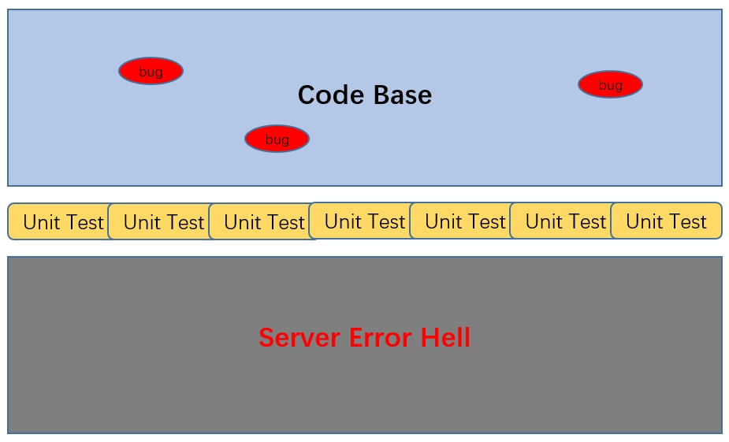

= spring-boot-mybatis-test

== 单元测试的意义

单元测试是代码库的防护网，可以在编译期间就发现存在的bug，避免最终生产环境异常

== 错误的测试

* 写多个 `main` 方法或者不断修改一个 `main`
* 写一个 `@SpringBootTest` 跑一下
* 自己电脑上装了个数据库，测试只能在自己电脑上面跑
* 打包部署的时候跳过测试

== 正确的测试

* 使用内存数据库，任何人任何环境都能跑
* 不同方法不同测试用例，甚至一个方法多个测试用例
* 了解框架提供的测试功能

TIP: 单元测试相关的理论很多，写好一个测试用例的原则也不只上面两条，读者自行查找阅读

== 参考资料

* https://docs.spring.io/spring-boot/docs/2.7.18/reference/htmlsingle/#features.testing[Spring Boot测试]
* https://github.com/mybatis/spring-boot-starter[mybatis-spring-boot-starter]

